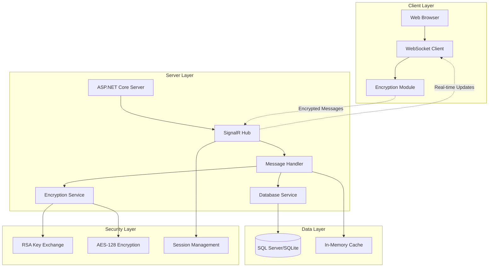
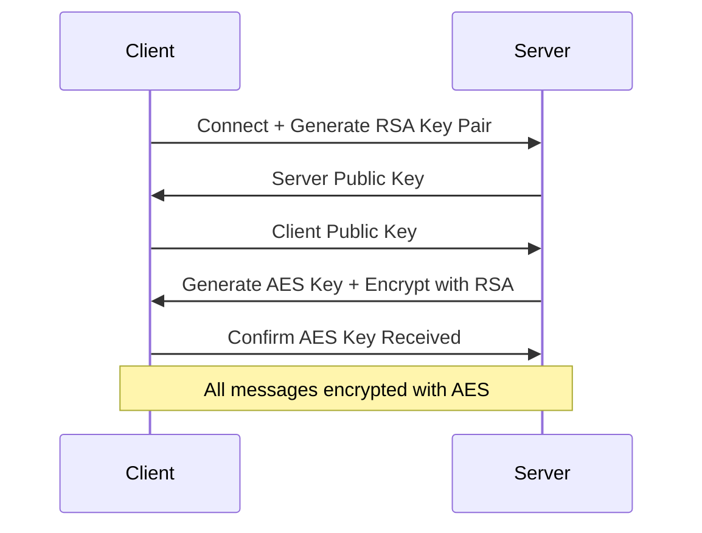

# Secure LAN Chat System - Technical Design

## Tổng quan

Hệ thống chat mã hóa end-to-end cho mạng LAN sử dụng kiến trúc Client-Server với WebSocket, mã hóa AES-128, và trao đổi khóa RSA. Hệ thống được thiết kế để hỗ trợ 100+ người dùng đồng thời với bảo mật cao và hiệu suất tối ưu.

## Kiến trúc hệ thống

### Kiến trúc tổng thể



### Kiến trúc chi tiết

**1. Client-Side Architecture:**
- **Web Interface**: HTML5 + CSS3 + JavaScript ES6+
- **WebSocket Client**: Kết nối real-time với server
- **Encryption Module**: Mã hóa/giải mã tin nhắn
- **UI Components**: React/Vanilla JS cho giao diện

**2. Server-Side Architecture:**
- **ASP.NET Core 6.0**: Web server chính
- **SignalR**: Real-time communication hub
- **Background Services**: Xử lý tin nhắn và quản lý session
- **Entity Framework Core**: ORM cho database operations

## Các thành phần và giao diện

### 1. Server Components

#### 1.1 ChatHub (SignalR Hub)
```csharp
public class ChatHub : Hub
{
    // Quản lý kết nối và nhóm chat
    // Xử lý tin nhắn real-time
    // Quản lý danh sách người dùng online
}
```

#### 1.2 EncryptionService
```csharp
public interface IEncryptionService
{
    Task<string> EncryptMessage(string message, string publicKey);
    Task<string> DecryptMessage(string encryptedMessage, string privateKey);
    Task<KeyPair> GenerateKeyPair();
    Task<string> ExchangePublicKey(string clientPublicKey);
}
```

#### 1.3 MessageService
```csharp
public interface IMessageService
{
    Task SendMessageAsync(string senderId, string receiverId, string content);
    Task SendBroadcastAsync(string senderId, string content);
    Task<List<Message>> GetMessageHistoryAsync(string userId);
    Task<List<User>> GetOnlineUsersAsync();
}
```

#### 1.4 UserService
```csharp
public interface IUserService
{
    Task<User> LoginAsync(string username);
    Task LogoutAsync(string userId);
    Task<bool> IsUserOnlineAsync(string userId);
    Task UpdateUserStatusAsync(string userId, UserStatus status);
}
```

### 2. Client Components

#### 2.1 ChatClient (JavaScript)
```javascript
class ChatClient {
    constructor() {
        this.connection = new signalR.HubConnectionBuilder()
            .withUrl("/chathub")
            .build();
        this.encryption = new EncryptionModule();
    }
    
    async connect() { /* Kết nối WebSocket */ }
    async sendMessage(content, receiverId) { /* Gửi tin nhắn */ }
    async sendBroadcast(content) { /* Gửi broadcast */ }
}
```

#### 2.2 EncryptionModule (JavaScript)
```javascript
class EncryptionModule {
    async generateKeyPair() { /* Tạo cặp khóa RSA */ }
    async encryptMessage(message, publicKey) { /* Mã hóa AES */ }
    async decryptMessage(encryptedMessage, privateKey) { /* Giải mã AES */ }
}
```

## Mô hình dữ liệu

### 1. Database Schema

#### 1.1 Users Table
```sql
CREATE TABLE Users (
    Id UNIQUEIDENTIFIER PRIMARY KEY,
    Username NVARCHAR(50) UNIQUE NOT NULL,
    PublicKey NVARCHAR(2048) NOT NULL,
    IsOnline BIT DEFAULT 0,
    LastSeen DATETIME2,
    CreatedAt DATETIME2 DEFAULT GETUTCDATE()
);
```

#### 1.2 Messages Table
```sql
CREATE TABLE Messages (
    Id UNIQUEIDENTIFIER PRIMARY KEY,
    SenderId UNIQUEIDENTIFIER NOT NULL,
    ReceiverId UNIQUEIDENTIFIER NULL, -- NULL = broadcast
    Content NVARCHAR(MAX) NOT NULL, -- Encrypted content
    IV NVARCHAR(32) NOT NULL, -- Initialization Vector
    MessageType INT NOT NULL, -- 1=Private, 2=Broadcast
    CreatedAt DATETIME2 DEFAULT GETUTCDATE(),
    FOREIGN KEY (SenderId) REFERENCES Users(Id),
    FOREIGN KEY (ReceiverId) REFERENCES Users(Id)
);
```

#### 1.3 Sessions Table
```sql
CREATE TABLE Sessions (
    Id UNIQUEIDENTIFIER PRIMARY KEY,
    UserId UNIQUEIDENTIFIER NOT NULL,
    ConnectionId NVARCHAR(100) NOT NULL,
    AESKey NVARCHAR(256) NOT NULL, -- Encrypted AES key
    CreatedAt DATETIME2 DEFAULT GETUTCDATE(),
    ExpiresAt DATETIME2 NOT NULL,
    FOREIGN KEY (UserId) REFERENCES Users(Id)
);
```

### 2. Data Models (C#)

#### 2.1 User Model
```csharp
public class User
{
    public Guid Id { get; set; }
    public string Username { get; set; }
    public string PublicKey { get; set; }
    public bool IsOnline { get; set; }
    public DateTime LastSeen { get; set; }
    public DateTime CreatedAt { get; set; }
}
```

#### 2.2 Message Model
```csharp
public class Message
{
    public Guid Id { get; set; }
    public Guid SenderId { get; set; }
    public Guid? ReceiverId { get; set; }
    public string Content { get; set; }
    public string IV { get; set; }
    public MessageType MessageType { get; set; }
    public DateTime CreatedAt { get; set; }
    public User Sender { get; set; }
    public User Receiver { get; set; }
}

public enum MessageType
{
    Private = 1,
    Broadcast = 2
}
```

## Xử lý lỗi

### 1. Error Handling Strategy

#### 1.1 Server-Side Error Handling
```csharp
public class GlobalExceptionMiddleware
{
    public async Task InvokeAsync(HttpContext context, RequestDelegate next)
    {
        try
        {
            await next(context);
        }
        catch (Exception ex)
        {
            await HandleExceptionAsync(context, ex);
        }
    }
    
    private async Task HandleExceptionAsync(HttpContext context, Exception exception)
    {
        // Log error
        // Return appropriate error response
        // Notify client about error
    }
}
```

#### 1.2 Client-Side Error Handling
```javascript
class ErrorHandler {
    static handleConnectionError(error) {
        console.error('Connection error:', error);
        this.showNotification('Kết nối bị gián đoạn. Đang thử kết nối lại...');
        this.reconnect();
    }
    
    static handleEncryptionError(error) {
        console.error('Encryption error:', error);
        this.showNotification('Lỗi mã hóa. Vui lòng thử lại.');
    }
}
```

### 2. Error Types và Recovery

#### 2.1 Connection Errors
- **Mất kết nối WebSocket**: Tự động reconnect với exponential backoff
- **Timeout**: Retry mechanism với timeout tăng dần
- **Server unavailable**: Hiển thị thông báo và thử kết nối lại

#### 2.2 Encryption Errors
- **Key exchange failed**: Tạo cặp khóa mới và thử lại
- **Decryption failed**: Yêu cầu gửi lại tin nhắn
- **Invalid key format**: Validate và tạo khóa mới

#### 2.3 Database Errors
- **Connection timeout**: Retry với connection pooling
- **Deadlock**: Retry transaction với random delay
- **Constraint violation**: Validate data trước khi lưu

## Chiến lược bảo mật

### 1. Mã hóa End-to-End

#### 1.1 Key Exchange Process


#### 1.2 Message Encryption Flow
```csharp
public class MessageEncryption
{
    public async Task<EncryptedMessage> EncryptMessage(string content, string aesKey)
    {
        var iv = GenerateRandomIV();
        var encryptedContent = await AesEncrypt(content, aesKey, iv);
        
        return new EncryptedMessage
        {
            Content = encryptedContent,
            IV = Convert.ToBase64String(iv),
            Timestamp = DateTime.UtcNow
        };
    }
}
```

### 2. Session Management

#### 2.1 Session Security
- Mỗi session có AES key riêng biệt
- Session timeout sau 24 giờ không hoạt động
- Automatic cleanup cho expired sessions
- Session validation cho mỗi request

#### 2.2 Authentication Flow
```csharp
public class AuthenticationService
{
    public async Task<AuthResult> AuthenticateUser(string username)
    {
        // Validate username uniqueness
        // Generate session token
        // Create encrypted session
        // Return authentication result
    }
}
```

## Chiến lược testing

### 1. Unit Testing

#### 1.1 Server Tests
```csharp
[TestClass]
public class EncryptionServiceTests
{
    [TestMethod]
    public async Task EncryptMessage_ShouldReturnEncryptedContent()
    {
        // Arrange
        var service = new EncryptionService();
        var message = "Test message";
        var key = "test-key";
        
        // Act
        var result = await service.EncryptMessage(message, key);
        
        // Assert
        Assert.IsNotNull(result);
        Assert.AreNotEqual(message, result.Content);
    }
}
```

#### 1.2 Client Tests
```javascript
describe('ChatClient', () => {
    test('should connect to server successfully', async () => {
        const client = new ChatClient();
        await client.connect();
        expect(client.isConnected).toBe(true);
    });
    
    test('should encrypt message before sending', async () => {
        const client = new ChatClient();
        const message = 'Test message';
        const encrypted = await client.encryptMessage(message);
        expect(encrypted).not.toBe(message);
    });
});
```

### 2. Integration Testing

#### 2.1 End-to-End Tests
- Test complete message flow từ client đến client
- Test encryption/decryption cycle
- Test real-time message delivery
- Test user authentication flow

#### 2.2 Performance Testing
- Load testing với 100+ concurrent users
- Stress testing để tìm breaking point
- Memory leak testing cho long-running sessions
- Network latency simulation

### 3. Security Testing

#### 3.1 Penetration Testing
- Test SQL injection prevention
- Test XSS protection
- Test CSRF protection
- Test encryption strength

#### 3.2 Vulnerability Assessment
- Dependency vulnerability scanning
- Code analysis với security tools
- Network security testing
- Authentication bypass testing

## Triển khai và cấu hình

### 1. Development Environment

#### 1.1 Prerequisites
- Visual Studio 2022
- .NET 6.0 SDK
- SQL Server LocalDB hoặc SQLite
- Node.js (cho frontend development)

#### 1.2 Project Structure
```
SecureLanChat/
├── src/
│   ├── Server/
│   │   ├── Controllers/
│   │   ├── Hubs/
│   │   ├── Services/
│   │   ├── Models/
│   │   └── Middleware/
│   ├── Client/
│   │   ├── wwwroot/
│   │   │   ├── css/
│   │   │   ├── js/
│   │   │   └── html/
│   │   └── Views/
│   └── Shared/
│       ├── Models/
│       └── Interfaces/
├── tests/
│   ├── UnitTests/
│   ├── IntegrationTests/
│   └── PerformanceTests/
└── docs/
    ├── API/
    └── Deployment/
```

### 2. Configuration

#### 2.1 appsettings.json
```json
{
  "ConnectionStrings": {
    "DefaultConnection": "Server=(localdb)\\mssqllocaldb;Database=SecureLanChat;Trusted_Connection=true;"
  },
  "Encryption": {
    "AESKeySize": 128,
    "RSAKeySize": 2048,
    "IVSize": 16
  },
  "Server": {
    "Port": 5000,
    "MaxConnections": 150,
    "SessionTimeout": 24
  },
  "Logging": {
    "LogLevel": {
      "Default": "Information",
      "Microsoft.AspNetCore.SignalR": "Debug"
    }
  }
}
```

### 3. Deployment

#### 3.1 Docker Support
```dockerfile
FROM mcr.microsoft.com/dotnet/aspnet:6.0 AS base
WORKDIR /app
EXPOSE 80
EXPOSE 443

FROM mcr.microsoft.com/dotnet/sdk:6.0 AS build
WORKDIR /src
COPY ["SecureLanChat.csproj", "."]
RUN dotnet restore
COPY . .
RUN dotnet build -c Release -o /app/build

FROM build AS publish
RUN dotnet publish -c Release -o /app/publish

FROM base AS final
WORKDIR /app
COPY --from=publish /app/publish .
ENTRYPOINT ["dotnet", "SecureLanChat.dll"]
```

#### 3.2 Production Configuration
- HTTPS enforcement
- CORS configuration cho LAN access
- Database connection pooling
- Logging và monitoring setup
- Health check endpoints

## Monitoring và Logging

### 1. Logging Strategy

#### 1.1 Structured Logging
```csharp
public class ChatLogger
{
    private readonly ILogger<ChatLogger> _logger;
    
    public void LogMessageSent(string senderId, string receiverId, bool isBroadcast)
    {
        _logger.LogInformation("Message sent from {SenderId} to {ReceiverId}, Broadcast: {IsBroadcast}", 
            senderId, receiverId, isBroadcast);
    }
    
    public void LogEncryptionError(string userId, string error)
    {
        _logger.LogError("Encryption error for user {UserId}: {Error}", userId, error);
    }
}
```

### 2. Performance Monitoring

#### 2.1 Metrics Collection
- Message throughput (messages/second)
- Connection count và duration
- Encryption/decryption performance
- Database query performance
- Memory usage và GC pressure

#### 2.2 Health Checks
```csharp
public class ChatHealthCheck : IHealthCheck
{
    public async Task<HealthCheckResult> CheckHealthAsync(HealthCheckContext context, CancellationToken cancellationToken = default)
    {
        // Check database connectivity
        // Check encryption service status
        // Check SignalR hub status
        // Return health status
    }
}
```

## Kết luận

Thiết kế này cung cấp một nền tảng vững chắc cho hệ thống chat mã hóa LAN với:

- **Bảo mật cao**: Mã hóa AES-128 + RSA, forward secrecy
- **Hiệu suất tốt**: Hỗ trợ 100+ users, response time < 100ms
- **Khả năng mở rộng**: Kiến trúc modular, dễ thêm tính năng
- **Triển khai linh hoạt**: Cross-platform, Docker support
- **Monitoring đầy đủ**: Logging, health checks, performance metrics

Thiết kế này đảm bảo đáp ứng tất cả yêu cầu đã được xác định trong giai đoạn requirements gathering.
